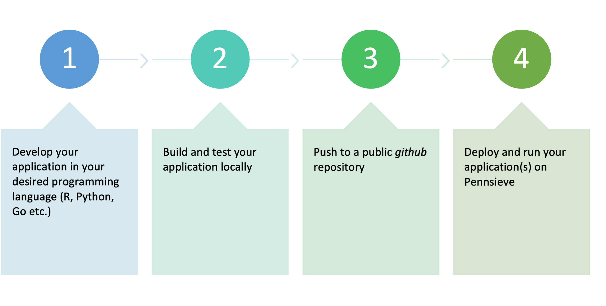

# Python Application Template for Pennsieve

A template and guide for building custom applications to run on the Pennsieve platform. This repository serves as both documentation and a working example that you can use as a starting point for your own applications.

## Overview

This guide walks you through developing, testing, and deploying custom applications on Pennsieve. Applications allow you to create automated workflows that process data within the Pennsieve platform, supporting any programming language that can be containerized with Docker (Python, R, Go, JavaScript, etc.).

### Workflow

Building an application for Pennsieve follows a four-step process:



1. **Develop your application** in your desired programming language
2. **Build and test your application locally** using Docker
3. **Push to a public GitHub repository**
4. **Deploy and run your application(s) on Pennsieve**

### How Applications Work


Pennsieve applications follow a simple input-output model:
- Your application reads input files from a designated directory
- Processes them according to your custom logic
- Writes output files to an output directory

The platform handles file management, while your application focuses solely on the processing logic.

---

## Prerequisites

Before you begin, ensure you have:

- **Docker** installed on your local machine ([Install Docker](https://docs.docker.com/get-docker/))
- **Git** for version control
- A **public GitHub repository** for hosting your application
- Basic knowledge of your chosen programming language

---

## Step 1: Developing Your Application

### Core Requirements

Your application must use three environment variables to access directories:

- **`INPUT_DIR`**: Directory containing input files to process
- **`OUTPUT_DIR`**: Directory where your application writes results
- **`RESOURCES_DIR`**: Directory for static resources (optional)

### Application Manifest (application.json)

Every Pennsieve application requires an `application.json` file that describes inputs, outputs, and parameters.

**Example from this repository:**

```json
{
  "name": "echo-application",
  "description": "echo-application",
  "version": "1.0.0",
  "inputs": [
    {
      "name": "Packages",
      "description": "Pipeline packages",
      "path": "/input",
      "files": [
        {
          "id": "package_file",
          "description": "A package file",
          "ext": "*",
          "required": true
        }
      ]
    }
  ],
  "outputs": [
    {
      "name": "Packages",
      "description": "Pipeline packages",
      "path": "/output",
      "files": [
        {
          "id": "package_file",
          "description": "A package file",
          "ext": "*",
          "required": true
        }
      ]
    }
  ],
  "params": []
}
```

**Key fields:**
- **name**: Unique identifier for your application
- **description**: What your application does
- **version**: Semantic version number
- **inputs/outputs**: Array of file specifications
- **params**: Configurable parameters (optional)
- **depends_on**: File types your application can process (`["*"]` for all)

### Application Code

Your application should read from `INPUT_DIR`, process data, and write to `OUTPUT_DIR`.

**Example from this repository (`main.py`):**

```python
#!/usr/bin/env python3.9

import sys
import shutil
import os

def main():
    print("start of processing")
    src = os.environ['INPUT_DIR']
    dest = os.environ['OUTPUT_DIR']
    resources = os.environ['RESOURCES_DIR']

    print("Command line arguments ...")
    print(sys.argv)
    print("ENV variables ...")
    print(os.environ)

    list_files(resources)

    # Example: Read static resources
    if os.path.exists(f'{resources}/static-file.txt'):
        with open(f'{resources}/static-file.txt', "r") as file:
            content = file.read()
        print(content)

    # Process: Copy files from input to output
    shutil.copytree(src, dest, dirs_exist_ok=True)
    print("end of processing")

def list_files(startpath):
    for root, _, files in os.walk(startpath):
        level = root.replace(startpath, '').count(os.sep)
        indent = ' ' * 4 * (level)
        print('{}{}/'.format(indent, os.path.basename(root)))
        subindent = ' ' * 4 * (level + 1)
        for f in files:
            print('{}{}'.format(subindent, f))

if __name__ == '__main__':
    main()
```

### Dependencies

List your dependencies in `requirements.txt` (Python), `install.packages()` (R), or equivalent for your language.

**Example (`requirements.txt`):**
```
pandas
openpyxl
requests
```

### Adapting for Other Languages

This Python template can be adapted for any language:

**R Example:**
```r
#!/usr/bin/env Rscript

input_dir <- Sys.getenv("INPUT_DIR")
output_dir <- Sys.getenv("OUTPUT_DIR")
resources_dir <- Sys.getenv("RESOURCES_DIR")

# Your processing logic here
```

**Go Example:**
```go
package main

import "os"

func main() {
    inputDir := os.Getenv("INPUT_DIR")
    outputDir := os.Getenv("OUTPUT_DIR")
    resourcesDir := os.Getenv("RESOURCES_DIR")

    // Your processing logic here
}
```

---

## Step 2: Building and Testing Locally

### Dockerfile

The `Dockerfile` defines how to build your application container.

**Example from this repository:**

```dockerfile
FROM python:3.13.1

WORKDIR /service

RUN apt clean && apt-get update

COPY . .

RUN ls /service

RUN mkdir -p data

# Add additional dependencies below ...
RUN pip install -r /service/requirements.txt

ENTRYPOINT [ "python3.13", "/service/main.py" ]
```

**For other languages, modify the base image:**
- R: `FROM r-base:4.1.0`
- Go: `FROM golang:1.19`
- Node.js: `FROM node:18`

### Docker Compose Setup

**Example (`docker-compose.yml`):**

```yaml
version: '3.9'

services:
  hackathon-python:
    env_file:
      - dev.env
    image: hackathon/python
    volumes:
      - ./data:/service/data
    container_name: hackathon-python
    build:
      context: .
      dockerfile: ./Dockerfile
```

### Environment Configuration

**Example (`dev.env`):**

```bash
INPUT_DIR=/service/data/input
OUTPUT_DIR=/service/data/output
RESOURCES_DIR=/service/data/resources
```

### Local Testing Workflow

#### 1. Create Test Directory Structure

```bash
mkdir -p data/input data/output data/resources
```

Your structure should look like:
```
python-application-template/
├── data/
│   ├── input/       # Place test input files here
│   ├── output/      # Application writes results here
│   └── resources/   # Optional: static resources
├── main.py
├── application.json
├── Dockerfile
├── docker-compose.yml
├── dev.env
├── requirements.txt
└── README.md
```

#### 2. Add Test Data

Create test files in `data/input/`:

```bash
echo "test data" > data/input/test.txt
```

You can also add static resources:

```bash
echo "static content" > data/resources/static-file.txt
```

#### 3. Build and Run

```bash
docker-compose up --build
```

This will:
1. Build your Docker image
2. Start a container with your application
3. Mount local directories for input/output
4. Run your application with the test data

#### 4. Verify Results

Check the `data/output/` directory for results:

```bash
ls -la data/output/
```

For this example application, test files should be copied from `input` to `output`.

#### 5. Review Logs

Check container logs for errors or debug information:

```bash
docker-compose logs
```

### Testing Iterations

As you develop:

1. Make code changes
2. Run `docker-compose up --build`
3. Verify output files in `data/output/`
4. Review logs
5. Clear output: `rm -rf data/output/*`
6. Repeat

### Troubleshooting

**Container exits immediately:**
- Check logs: `docker-compose logs`
- Verify environment variables are set correctly
- Check for syntax errors in your code

**Files not appearing in output:**
- Ensure code writes to `OUTPUT_DIR` environment variable
- Verify output directory has write permissions

**Dependencies not installed:**
- Check `requirements.txt` is correct
- Rebuild: `docker-compose up --build`

---

## Step 3: Pushing to a Public GitHub Repository

Once your application works locally, push it to a public GitHub repository.

### Repository Checklist

Ensure your repository includes:

- [x] Application code (`main.py`, `main.R`, etc.)
- [x] `application.json`
- [x] `Dockerfile`
- [x] Dependency files (`requirements.txt`, etc.)
- [x] `README.md` with clear documentation
- [x] `.gitignore` to exclude test data

### Create .gitignore

```
# Test data directories
data/

# Python
*.pyc
__pycache__/
venv/
env/

# Environment files
*.env

# IDE files
.vscode/
.idea/

# OS files
.DS_Store
```

**Important:** Do not commit the `data/` directory or sensitive environment variables.

### Push to GitHub

```bash
# Initialize git (if not already done)
git init

# Add files
git add .

# Commit
git commit -m "Initial commit: Pennsieve application"

# Add remote (replace with your repository URL)
git remote add origin https://github.com/YOUR_USERNAME/YOUR_REPO.git

# Push
git branch -M main
git push -u origin main
```

### Repository Visibility

Pennsieve currently requires a **public GitHub repository** to build your application. Ensure visibility is set to public in your GitHub repository settings.

> **Note**: Private repository support is currently in development and will be available in a future release.

### Versioning

Tag your releases using semantic versioning:

```bash
git tag -a v1.0.0 -m "Initial release"
git push origin v1.0.0
```

---

## Step 4: Deploying to Pennsieve

With your application in a public GitHub repository, you can now register it with Pennsieve.

### Registration

Follow the official Pennsieve documentation to register your application:

**[Registering Analytic Workflows](https://docs.pennsieve.io/docs/registering-analytic-workflows)**

The registration process:

1. Navigate to the workflows section in your Pennsieve workspace
2. Click to register a new application
3. Provide your GitHub repository URL
4. Test your application on sample data

### Running on Pennsieve

Once registered, you can:

1. Select files or packages in your dataset
2. Choose your registered application
3. Configure parameters (if defined)
4. Start the workflow

Pennsieve handles:
- Container orchestration
- File mounting
- Execution monitoring
- Output capture and storage

---

## Using This Template

### Option 1: Clone and Modify

```bash
# Clone this repository
git clone https://github.com/Penn-I3H/python-application-template.git my-app

# Navigate to directory
cd my-app

# Remove git history to start fresh
rm -rf .git
git init

# Modify files for your use case
# - Update main.py with your processing logic
# - Update application.json with your inputs/outputs
# - Update requirements.txt with your dependencies
# - Update README.md with your documentation

# Test locally
docker-compose up --build

# Push to your own repository
git remote add origin https://github.com/YOUR_USERNAME/YOUR_REPO.git
git add .
git commit -m "Initial commit"
git push -u origin main
```

### Option 2: Use as Reference

Reference this repository structure and adapt it to your preferred language while maintaining the same directory structure and environment variable usage.

---

## Best Practices

### Development
- Write clear, well-commented code
- Implement robust error handling
- Log progress and errors to stdout
- Validate inputs before processing

### Docker
- Minimize image size
- Use specific base image versions (not `latest`)
- Cache dependencies appropriately
- Use multi-stage builds when possible

### Testing
- Test with various input types
- Test edge cases and error conditions
- Verify output format and content
- Test resource file access if used

### Documentation
- Keep README updated with changes
- Document expected input/output formats
- Provide usage examples
- Include troubleshooting tips

---

## Resources

- **This Template Repository**: [https://github.com/Penn-I3H/python-application-template](https://github.com/Penn-I3H/python-application-template)
- **Pennsieve Documentation**: [https://docs.pennsieve.io](https://docs.pennsieve.io)
- **Registering Workflows**: [https://docs.pennsieve.io/docs/registering-analytic-workflows](https://docs.pennsieve.io/docs/registering-analytic-workflows)
- **Docker Documentation**: [https://docs.docker.com](https://docs.docker.com)

---

## Summary

You've learned how to:

1. ✅ Structure a Pennsieve application with required environment variables
2. ✅ Create `application.json` to define inputs and outputs
3. ✅ Build and test locally using Docker and Docker Compose
4. ✅ Push to a public GitHub repository
5. ✅ Register and deploy on Pennsieve

This template provides everything you need to start building custom data processing workflows on Pennsieve in any language that supports Docker containerization.
